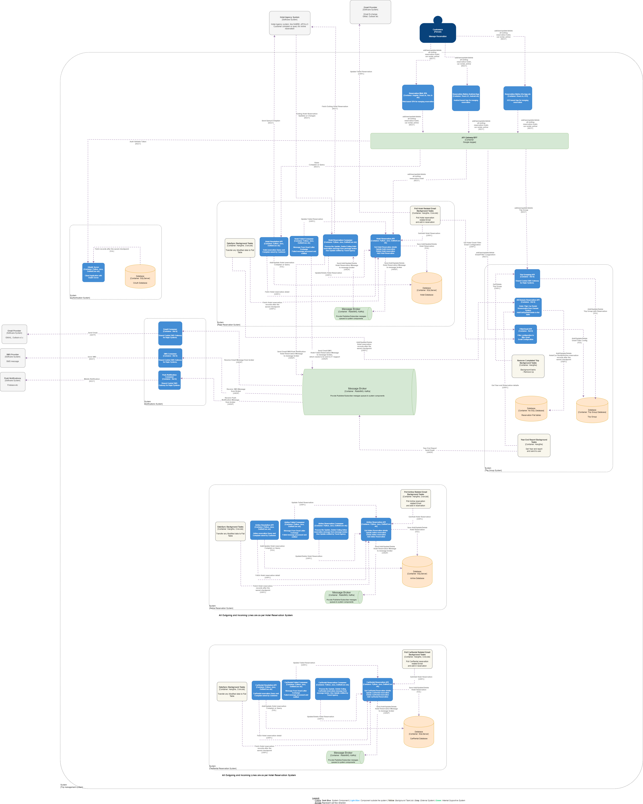
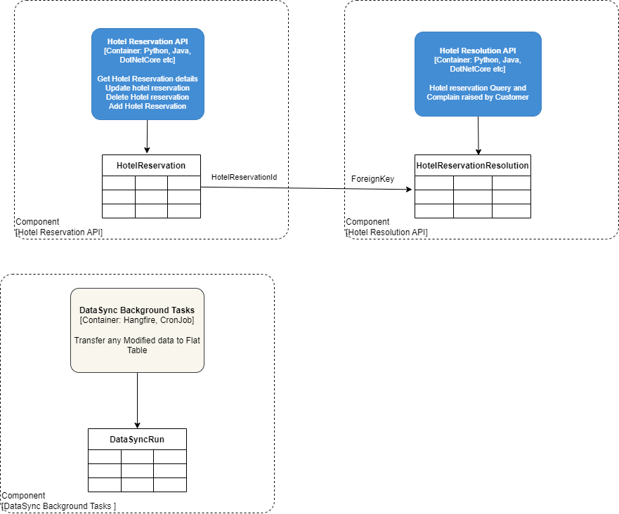

- [Motivation](#motivation)
- [2. Bussiness Requirement](#2-bussiness-requirement)
- [3. Technical Requirement](#3-technical-requirement)
- [4. Bussiness Achitecture](#4-bussiness-achitecture)
  - [4.1. Actors](#41-actors)
    - [4.1.1. Customers](#411-customers)
    - [4.1.2. Reservation System](#412-reservation-system)
    - [4.1.3. External Reservation System](#413-external-reservation-system)
    - [4.1.4. IT Support](#414-it-support)
  - [4.2. Business Processes](#42-business-processes)
    - [4.2.1. Hotel Reservation flow](#421-hotel-reservation-flow)
    - [4.2.2. Hotel Reservation update flow](#422-hotel-reservation-update-flow)
- [5. Information System Architecture](#5-information-system-architecture)
  - [5.1. Application Architecture](#51-application-architecture)
    - [5.1.1. Context Diagram](#511-context-diagram)
    - [5.1.2. Container Diagram](#512-container-diagram)
    - [5.1.3. Hotel Reservation Sequence](#513-hotel-reservation-sequence)
    - [5.1.4. Hotel Reservation Update Sequence](#514-hotel-reservation-update-sequence)
  - [5.2. Data Architecture](#52-data-architecture)
    - [5.2.1. Hotel Reservation System Data Architecture](#521-hotel-reservation-system-data-architecture)
    - [5.2.2. Notification System Data Architecture](#522-notification-system-data-architecture)
    - [5.2.3. Trip Group System Data Architecture](#523-trip-group-system-data-architecture)
    - [5.2.4. Error Logs Data](#524-error-logs-data)
- [6. Technology Architecture](#6-technology-architecture)
  - [6.1. Infratructure Diagram](#61-infratructure-diagram)
- [7. Architecture Quality Attributes](#7-architecture-quality-attributes)
  - [7.1. Two million active users/week - Scalability](#71-two-million-active-usersweek---scalability)
  - [7.2. Access the system at all times - Availability](#72-access-the-system-at-all-times---availability)
  - [7.3. Travel updates within 5 minutes - Responsiveness](#73-travel-updates-within-5-minutes---responsiveness)
  - [7.4. Response time from web (800ms) - Usability and User Experience (UX)](#74-response-time-from-web-800ms---usability-and-user-experience-ux)
  - [7.5. Richest user interface possible across all deployment platforms - Performance](#75-richest-user-interface-possible-across-all-deployment-platforms---performance)
  - [7.6. Autentication](#76-autentication)
- [8. Architecture Decision Records](#8-architecture-decision-records)
  - [8.1. Architectural Structures and Styles](#81-architectural-structures-and-styles)
    - [8.1.1. Status](#811-status)
    - [8.1.2. Context](#812-context)
    - [8.1.3. Decision](#813-decision)
    - [8.1.4. Consequences](#814-consequences)
  - [8.2. Business logic and Infrastructural pattern](#82-business-logic-and-infrastructural-pattern)
    - [8.2.1. Status](#821-status)
    - [8.2.2. Context](#822-context)
    - [8.2.3. Decision](#823-decision)
    - [8.2.4. Consequences](#824-consequences)
  - [8.3. Codebase pattern](#83-codebase-pattern)
    - [8.3.1. Status](#831-status)
    - [8.3.2. Context](#832-context)
    - [8.3.3. Decision](#833-decision)
    - [8.3.4. Consequences](#834-consequences)
  - [8.4. Codebase Pattern](#84-codebase-pattern)
    - [8.4.1. Status](#841-status)
    - [8.4.2. Context](#842-context)
    - [8.4.3. Decision](#843-decision)
    - [8.4.4. Consequences](#844-consequences)
  - [8.5. Data Ownership](#85-data-ownership)
    - [8.5.1. Status](#851-status)
    - [8.5.2. Context](#852-context)
    - [8.5.3. Decision](#853-decision)
    - [8.5.4. Consequences](#854-consequences)
  - [8.6. Hosting Platform](#86-hosting-platform)
    - [8.6.1. Status](#861-status)
    - [8.6.2. Context](#862-context)
    - [8.6.3. Decision](#863-decision)
    - [8.6.4. Consequences](#864-consequences)
  - [8.7. Rich user interface](#87-rich-user-interface)
    - [8.7.1. Status](#871-status)
    - [8.7.2. Context](#872-context)
    - [8.7.3. Decision](#873-decision)
    - [8.7.4. Consequences](#874-consequences)
  - [8.8. Performance and Scalability](#88-performance-and-scalability)
    - [8.8.1. Status](#881-status)
    - [8.8.2. Context](#882-context)
    - [8.8.3. Decision](#883-decision)
    - [8.8.4. Consequences](#884-consequences)
#	Motivation
A new startup wants to build the next generation online trip management dashboard to allow travelers to see all of their existing reservations organized by trip either online (web) 
or through their mobile device.
# 2. Bussiness Requirement 
- Poll email looking for travel-related emails
- Filter and whitelist certain emails
- The system must interface with the agency’s existing airline, hotel, and car rental interface system to update travel details (delays, cancellations, updates, gate changes, etc.). Updates must be in the app within 5 minutes of an update (better than the competition)
- Customers should be able to add, update, or delete existing reservations manually as well.
- Items in the dashboard should be able to be 
grouped by trip, and once the trip is complete, the 
items should automatically be removed from the 
dashboard.
- Users should also be able to share their trip 
information by interfacing with standard social 
media sites or allowing targeted people to view 
your trip.
- Richest user interface possible across all deployment platforms requirements
- Provide end-of-year summary reports for users with a wide range of metrics about their travel usage
- Road Warrior gathers analytical data from users 
trips for various purposes 
- travel trends, locations, airline and hotel vendor preferences, cancellation and update frequency, and so on
- Must integrate seamlessly with existing travel systems (i.e, SABRE, APOLLO)
- Must integrate with preferred travel agency for quick problem resolution (help me!)
- Must work internationally
  
# 3. Technical Requirement 
- Million active users/week
- Total users: 15 million (user accounts)
Users must be able to access the system at all times (max 5 minutes per month of unplanned downtime)
- Travel updates must be presented in the app within 5 minutes of generation by the source 
- Response time from web (800ms) and mobile (First-contentful paint of under 1.4 sec)
  
# 4. Bussiness Achitecture
Express and relate organizational structure, products, services, functions, processes, and information. 
## 4.1. Actors
### 4.1.1. Customers
- View current reservations (hotel, airline, car rental)
- Add, update, or delete existing (hotel, airline, car rental) reservations 
- Share their trip to social media or targeted group
- Group current trip reservation  (hotel, airline, car rental)
- Raise query or complain about the reservation
- Filter and whitelist certain emails

### 4.1.2. Reservation System
- Poll email to check the travel related emails
- Remove completed trip
- Send end-of-year summary reports
- Gathers analytical data 
- Add, Updat, or delete existing (hotel, airline, car rental) reservations from respective external reservation system
- Raise query to respective external query resolution agency
- Send existing (hotel, airline, car rental) reservations updates to client
  
### 4.1.3. External Reservation System
- Update, or delete existing (hotel, airline, car rental) reservations  details
- Send quick problem resolution response
- Send the exiting (hotel, airline, car rental) reservations  details
- Send reservation updates to Reservation System

### 4.1.4. IT Support
- Receive email about failures 
- Handle any manual intervention required in case of failure

## 4.2. Business Processes
The system has the following business workflow scenario.
- (Hotel, airline, car rental)  reservation flow
- Reservation Problem Resolution flow
- (Hotel, airline, car rental) reservation update flow
- Trip grouping flow

### 4.2.1. Hotel Reservation flow

### 4.2.2. Hotel Reservation update flow

# 5. Information System Architecture

## 5.1. Application Architecture
### 5.1.1. Context Diagram

| System            | Owner          | System Type                  | Description                                                                                                                  |
|-------------------|----------------------|----------------------------|---------------------------------------------------------------------------------------------------------------------------|
| Trip management System| Our System       | Mobile App + Web + APIs + Background Jobs + Queues      | <li>Web + APIs + Background Jobs + Queues</li><li>Filter and whitelist certain emails </li><li>share their trip to social media </li>         |
| Trip Agency System| External System       | External Service    | <li>Get exiting reservation Hotel, CarRental, Airline</li> <li>Any reservation Update Hotel, CarRental, Airline, will be notified</li>      |
| Social Media System| External System       | External Service    | <li>Trip will be shared to social media</li>      |
| Email System| External System       | External Service    | <li>Email will be sent by exchange</li>      |
| Map System| External System       | External Service    | <li>Map will be displayed in web and mobile user interface</li>      |
| Analytical System| External System       | External Service    | <li>User analytical data will be send and saved</li>      |

### 5.1.2. Container Diagram

| System            | Sub System           | Component                  | Function                                                                                                                  |
|-------------------|----------------------|----------------------------|---------------------------------------------------------------------------------------------------------------------------|
| Trip management System| Hotel System         | Hotel Reservation API       | <li>Customer sends to add/update/delete existing hotel reservations to broker</li><li>Saves reservation in Database           |
| Trip management System| Hotel System         | Hotel Reservation Consumer  | <li>Receives add/update/delete existing hotel reservations from broker</li><li>Fetches reservation details from external reservation system</li><li>Updates reservation details by calling Hotel Reservation API</li><li>Notifies the customer Email/SMS/ |
| Trip management System| Hotel System         | Hotel Failed Consumer       | <li>Receives failed or messages in dead letter exchange for existing hotel reservations from broker</li><li>Updates reservation details by calling Hotel Reservation API</li><li>Notifies the IT Support by Email/SMS/ |
| Trip management System| Hotel System         | Hotel Resolution API        | <li>Receives complaints and queries from customers</li><li>Calls the external agency reservation API for complaint and query API</li><li>Fetches hotel reservation details</li><li>Saves the query complaints in the database |
| Trip management System| Hotel System         | DataSync Background Tasks   | <li>Acts as projection engines</li><li>Gets the hotel reservation records in batch from the last checkpoint</li><li>Saves the hotel reservation records in a flat table |
| Trip management System| Hotel System       | Poll Hotel Related Email Background Tasks   | Background Job <li>Fetches email filter and email configuration </li><li> Reads the email and saves  or update hotel reservation </li>  |
| Trip management System| Hotel System         | Hotel Reservation Database  | <li>Maintain Hotel reservation </li><li>Maintain hotel resolution</li>|
| Trip management System| Airline System       | Airline Reservation API     | <li>Customer sends to add/update/delete existing airline reservations to broker</li><li>Saves reservation in Database         |
| Trip management System| Airline System       | Airline Reservation Consumer| <li>Receives add/update/delete existing airline reservations from broker</li><li>Fetches reservation details from external reservation system</li><li>Updates reservation details by calling Airline Reservation API</li><li>Notifies the customer Email/SMS/ |
| Trip management System| Airline System       | Airline Failed Consumer     | <li>Receives failed or messages in the dead letter exchange for existing airline reservations from broker</li><li>Updates reservation details by calling Airline Reservation API</li><li>Notifies the IT Support by Email/SMS/ |
| Trip management System| Airline System       | Airline Resolution API      | <li>Receives complaints and queries from customers</li><li>Calls the external agency reservation API for complaint and query API</li><li>Fetches airline reservation details</li><li>Saves the query complaints in the database |
| Trip management System| Airline System       | DataSync Background Tasks   | <li>Acts as projection engines</li><li>Gets the airline reservation records in batch from the last checkpoint</li><li>Saves the airline reservation records in a flat table |
| Trip management System| Airline System       | Poll Airline Related Email Background Tasks   | Background Job <li>Fetches email filter and email configuration </li><li> Reads the email and saves  or update airline reservation </li>  |
| Trip management System| Airline System         | Airline Reservation Database  | <li>Maintain Airline reservation </li><li>Maintain airline resolution</li>|
| Trip management System| CarRental System     | CarRental Reservation API   | <li>Customer sends to add/update/delete existing car rental reservations to broker</li><li>Saves reservation in Database     |
| Trip management System| CarRental System     | CarRental Reservation Consumer| <li>Receives add/update/delete existing car rental reservations from broker</li><li>Fetches reservation details from external reservation system</li><li>Updates reservation details by calling CarRental Reservation API</li><li>Notifies the customer Email/SMS/ |
| Trip management System| CarRental System     | CarRental Failed Consumer  | <li>Receives failed or messages in the dead letter exchange for existing car rental reservations from broker</li><li>Updates reservation details by calling CarRental Reservation API</li><li>Notifies the IT Support by Email/SMS/ |
| Trip management System| CarRental System     | CarRental Resolution API   | <li>Receives complaints and queries from customers</li><li>Calls the external agency reservation API for complaint and query API</li><li>Fetches car rental reservation details</li><li>Saves the query complaints in the database |
| Trip management System| CarRental System     | DataSync Background Tasks   | <li>Acts as projection engines</li><li>Gets the car rental reservation records in batch from the last checkpoint</li><li>Saves the car rental reservation records in a flat table |
| Trip management System| Airline System       | Poll CarRental Related Email Background Tasks   | Background Job <li>Fetches email filter and email configuration </li><li> Reads the email and saves  or update car rental reservation </li>  |
| Trip management System| CarRental System         | CarRental Reservation Database  | <li>Maintain CarRental reservation </li><li>Maintain CarRental resolution</li>|
| Trip management System| Notification System     | Email Consumer   | <li>Receives message from broker</li><li>Send email to the recepient</li><li>Saves email message and status in Queue table |                                      
| Trip management System| Notification System     | Email Consumer   | <li>Receives message from broker</li><li>Send email to the Email Exchange </li><li>Saves email message and status in Queue table |    
| Trip management System| Notification System     | SMS Consumer   | <li>Receives message from broker</li><li>Send SMS to the provider </li><li>Saves SMS message and status in Queue table |    
| Trip management System| Notification System     | Push Notification Consumer   | <li>Receives message from broker</li><li>Send push notification to the provider </li><li>Saves Push notification message and status in Queue table |    
| External System|   | Email System   | <li>Send email to receipent</li> |  
| Trip management System|  Authentication  | SMS  Provider   | <li>Send SMS to receipent</li> |  
| External System|   | Push Notification  Provider   | <li>Send Push notification to receipent</li> |  
| Trip management System | Authentication  | OAuth Server   | <li>User authentication</li><li>Authenticate user and client based on OAuth flow</li> | 
| Trip management System | Authentication  | OAuth Database   | <li>Saves the user information</li><li>Saved client detaiks</li><li>Saved refresh token, user token</li> | 
| Trip management System | Trip Group System  | Trip Group API   | <li>Add/Delete/Update reservation in all domain to trip group</li><li>Saved in database</li> | 
| Trip management System | Trip Group System  | All Domain Reservation API   | <li>Add/Update/Delete all domain reservation to flat table</li> | 
| Trip management System | Trip Group System  | FilterEmail API   | <li>Filter email configuration add/update/delete saved to database </li> | 
| Trip management System | Trip Group System  | Remove Completed Trip Background Tasks   | Background Job <li>Mark the completed trip to status completed</li> | 
| Trip management System | Trip Group System  | Reservation Flat tables  | <li>Saves the all domain reservation in flat strucutre</li> | 
| Trip management System |   | Message Broker  | Message broker cluster for distributed messaging | 
| Trip management System | Trip Group System  | Trip Group Database  | Saving Trip group system | 
| Trip management System | Trip Group System  | Year End Report Background Tasks   |  <li> Background jobs runs yearly and send user year report of trip  </li> | 
| External System | Email Provider  | Email Service   |  <li> Send email to receipient </li> | 
| External System | SMS Provider  | SMS Service   |  <li> Send SMS to receipient </li> | 
| External System | Push Notifications  | Push Notifications Service   |  <li> Send Push Notifications to receipient </li> | 
| External System | Push Notifications  | Push Notifications Service   |  <li> Send Push Notifications to receipient </li> | 
| External System | Hotel Agency System  | Hotel Agency  Service   |  <li> Get exiting hotel reservation detail </li> <li> Notiy any update exiting hotel reservation detail  </li>| 
| External System | Airline Agency System  | Airline Agency  Service   |   <li> Get exiting Airline reservation detail </li> <li> Notiy any update exiting Airline reservation detail  </li> | 
| External System | CarRental Agency System | CarRental Agency  Service   |   <li> Get exiting CarRental reservation detail </li> <li> Notiy any update exiting CarRental reservation detail  </li> | 
| Trip management System | Frontend System |Reservation Web SPA  |   <li> Trip management web user interface </li> <li>Group Reservation  </li><li>Filter Email configuration  </li> | 
| Trip management System | Frontend System | Reservation Native Andriod App   |   <li>Trip management web user interface </li> <li>Group Reservation  </li><li>Filter Email configuration  </li> | 
| Trip management System | Frontend System | CarRental Agency  Service   |   <li>Trip management web user interface </li> <li>Group Reservation  </li><li>Filter Email configuration  </li> | 
| Trip management System | Gateway System | API Gateway/BFF   |   <li>Handle authentication of token  </li> <li>Manages the data aggregation and transformation according to user interface  </li>| 

### 5.1.3. Hotel Reservation Sequence

### 5.1.4. Hotel Reservation Update Sequence

## 5.2. Data Architecture
- We have below relational databases
  - Hotel Database
  - Airline Database
  - CarRental Database
  - TripGroup Database
- Only Single service can write to a table. Any service wants to write to the table, needs to call the respective service
- Also we have No SQL database, which is a flat table
### 5.2.1. Hotel Reservation System Data Architecture 

- Airline, Carental follow same architecture
### 5.2.2. Notification System Data Architecture 

### 5.2.3. Trip Group System Data Architecture 

### 5.2.4. Error Logs Data
- Error logs is saved in file in each system and pushed to elastic search server
- File beat or any other mechanis, can be used to send error file log to elastic server

# 6. Technology Architecture
## 6.1. Infratructure Diagram

Simlary physical diagram for other domain Airline, CarRental

| System  Component          | Cloud Component           | Description                  | 
|-------------------|----------------------|----------------------------|
| Load balancer | ELB | Any cloud component for scaling the load balancer |
| CDN |CDN |Content delivery network to improve responsiveness and latency. Also user from different regions |
| FrontEnd Web |Serverless |Any cloud provider for serverless |     
| BFF |Apigateway |Apigateway service in Cloud |    
| Hotel Reservation API |Serverless |Any cloud provider for serverless |    
| Hotel Resolution API |Serverless |Any cloud provider for serverless |    
| Hotel Reservation Consumer |Lambda |Lambda or Cloud funtions |   
| Hotel Reservation Failed Consumer |Lambda |Lambda or Cloud funtions |   
| Data Sync Background task |Lambda |Lambda or Cloud funtions |   
| OAuth Server |Serverless |Any cloud provider for serverless| 
| Message Broker Cluster |SQS |Any cloud provider for SQS with FIFO pattern and guranteed delivery at least once to consumer| 
| PushNotification  |SNS |Any cloud provider for SNS | 

# 7. Architecture Quality Attributes
## 7.1. Two million active users/week - Scalability 
Architecture needs to be capable to scale as the number of users grow and active. It requires careful planning and infrastructure design. 

## 7.2. Access the system at all times - Availability 
Ensuring availability in a system means that the system should be accessible and operational at all times, without significant interruptions or downtime. Availability is one of the key attributes of a reliable and robust system, and it is critical for providing a seamless user experience and meeting service level agreements (SLAs)

## 7.3. Travel updates within 5 minutes - Responsiveness
Responsiveness is a key quality attribute in system architecture that focuses on delivering timely and quick responses to user requests or system events.

## 7.4. Response time from web (800ms) - Usability and User Experience (UX)
A response time of 800 milliseconds for a web application represents a well-optimized and responsive system. It reflects the system's ability to swiftly process incoming requests, retrieve data, execute necessary operations, and deliver the desired content back to users.

## 7.5. Richest user interface possible across all deployment platforms - Performance
Usability and UX address the quality of the user interface and the overall user experience, ensuring that users can interact with the system effectively and enjoy a positive, intuitive, and engaging experience
## 7.6. Autentication
OAuth flow for authetication  the system and components. It works well with centralized and distributed architecture

# 8. Architecture Decision Records

##  8.1. Architectural Structures and Styles

### 8.1.1. Status 
Proposed

### 8.1.2. Context

The reservation sytsem spread across multiple domain like airline, hotel and car rental, also system needs to be scalable. We are looking for a  architectural structure of the system that promotes a clear understanding of our business domain and aligns software design with business goals.
 
### 8.1.3. Decision
After careful evaluation and consideration, we have decided to adopt Domain-Driven Design (DDD) as our architectural structure of the system. This decision is based on the following factors:
- DDD encourages a close collaboration between domain experts and developers, ensuring that our software reflects the real-world business domain. This alignment with business goals
-  DDD promotes modularization, making our system more scalable and maintainable as it grows.
- DDD emphasizes the use of a common language that bridges the gap between technical and non-technical stakeholders
- DDD's focus on bounded contexts and aggregates allows us to build and evolve components of our system independently
- Allowing teams to pinpoint exactly the area of the system that requires the change and also troubleshoot issue
- Changes in code are isolated to only one small part of the system
- Plug-in components are used to extend the application by adding functionality
- 
### 8.1.4. Consequences

The decision to adopt Domain-Driven Design (DDD) has the following consequences:
- Team members may need to invest time in learning DDD concepts and practices
- We may need to invest in tools and frameworks that support DDD practices
- Need to organize cross-functional teams with specialization

##   8.2. Business logic and Infrastructural pattern

### 8.2.1. Status 
Proposed

### 8.2.2. Context

The system needs to be scalable and low latency. Reservation system spread accorss multiple domain and compelxity will grow. We are looking for an architectural pattern to improve performance of query execution and there by latency will be improved.
 
### 8.2.3. Decision

After careful evaluation and consideration, we have decided to adopt the Command Query Responsibility Segregation (CQRS) architectural pattern as part of our system architecture. This decision is based on the following factors:
- CQRS devotes a single model to executing operations that modify the system’s state (system commands). 
- Syncronous Projecting Read Models

  - Improves the read query performance and overall application performance
  - The synchronous projection method makes it trivial to add new projections and regenerate existing ones from scratch. 
- CQRS allows us to scale the command and query sides independently. This is crucial for handling increasing workloads and ensuring optimal system performance.
- To leverage perfrmance benifit of search index for full text search, and prerendered flat files for fast data retrieval
### 8.2.4. Consequences

The decision to adopt CQRS has the following consequences:
- Team members may need to acquire knowledge and expertise in CQRS concepts, event sourcing, and related technologies.

##  8.3. Codebase pattern

### 8.3.1. Status 
Proposed

### 8.3.2. Context

 Reservation system spread accorss multiple domain and compelxity will grow. Different teams will create different code base style and pattern. Need to bring uniformity across projects and team
 
### 8.3.3. Decision

After careful evaluation and consideration, we have decided to adopt the Ports and Adapter architecture pattern architectural pattern as part of our system architecture. This decision is based on the following factors:
- Ports & adapters architecture a perfect fit for business logic implemented with the domain model pattern. 
- The architecture promotes testability by allowing us to isolate components (ports) and provide test implementations (adapters) for various interfaces

### 8.3.4. Consequences

The decision to adopt CQRS has the following consequences:
- Team members may need to acquire knowledge and expertise in Ports & adapters architecture.

##   8.4. Codebase Pattern

### 8.4.1. Status 
Proposed

### 8.4.2. Context

 Reservation system spread accorss multiple domain and compelxity will grow. Different teams will create different code base style and pattern. Need to bring uniformity across projects and team
 
### 8.4.3. Decision

After careful evaluation and consideration, we have decided to adopt the Ports and Adapter architecture pattern architectural pattern as part of our system architecture. This decision is based on the following factors:
- Ports & adapters architecture a perfect fit for business logic implemented with the domain model pattern. 
- The architecture promotes testability by allowing us to isolate components (ports) and provide test implementations (adapters) for various interfaces

### 8.4.4. Consequences

The decision to adopt CQRS has the following consequences:
- Team members may need to acquire knowledge and expertise in Ports & adapters architecture.

##   8.5. Data Ownership

### 8.5.1. Status 
Proposed

### 8.5.2. Context

 Reservation system spread accorss multiple domain and growing data and team structure the data maintenance and  structure will be a nightmare with different teams 
 
### 8.5.3. Decision

After careful evaluation and consideration, we have decided to adopt Single Ownership Data principle. This decision is based on the following factors:
- Single table ownership occurs when only one service writes to a table. 
- Preserve bounded context
- Clear defined resposnibility of service and data

### 8.5.4. Consequences

The decision to adopt Single reponsibility principle has the following consequences:
- Table might have to split in case of future enhancement
- The type of communication protocol (synchronous versus asynchronous) also matters when splitting a table

## 8.6. Hosting Platform

### 8.6.1. Status 
Proposed

### 8.6.2. Context

 Reservation system is complex system and requires infrasture in case hosted on premises
### 8.6.3. Decision

After careful evaluation and consideration, we have decided to adopt Cloud as Hosting Platform. Any cloud provide AWS/GCP/Azure can be used. This decision is based on the following factors:
- Hosting cost will be significantly reduced. 
- Scalability can easily acheived with our application design

### 8.6.4. Consequences

The decision to adopt Cloud hosting platform has the following consequences:
- Need expert and well trained cloud team
- Proper costing analysis need to be done for various cloud services
  
##   8.7. Rich user interface

### 8.7.1. Status 
Proposed

### 8.7.2. Context

 Reservation system has web and mobile interface and data needs to fetched from lots of services from front end application.
  
### 8.7.3. Decision

After careful evaluation and consideration, we have decided to adopt Backend for Frontend . This decision is based on the following factors:
- This pattern has proved to be very successful in helping handle the differing concerns of user interfaces
- Avoids becoming a bottleneck for development, with multiple teams all trying to share ownership.

### 8.7.4. Consequences

The decision to adopt Backend for Frontend pattern has the following consequences:
- Additional layer need to developed and maintanined
- Code duplication possible, so proper consideration proper bff
  

##   8.8. Performance and Scalability

### 8.8.1. Status 
Proposed

### 8.8.2. Context

 Reservation system needs to scalable to met demand of 1million lus users.
  
### 8.8.3. Decision

After careful evaluation and consideration, we have decided to adopt eventual consistency . This decision is based on the following factors:
- With distributed applciation and eventual consistency services can be scalable and good in performance
- Latency can be reduced.
- Applciation becomes more responsive

### 8.8.4. Consequences

The decision to eventual consistency  has the following consequences:
- Development team needs to be trained
- Handling distributed transaction is tricky
- Error handling is complex but can be